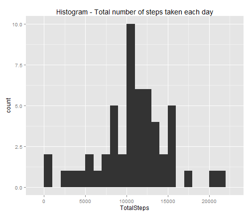
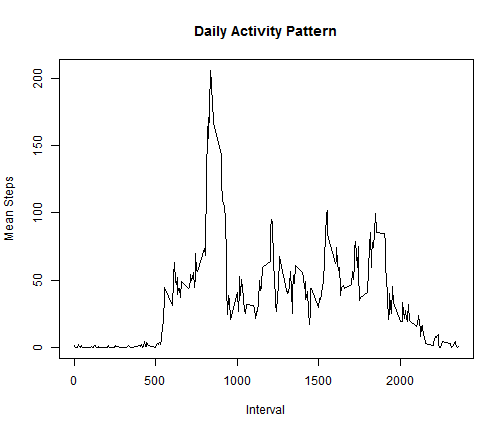
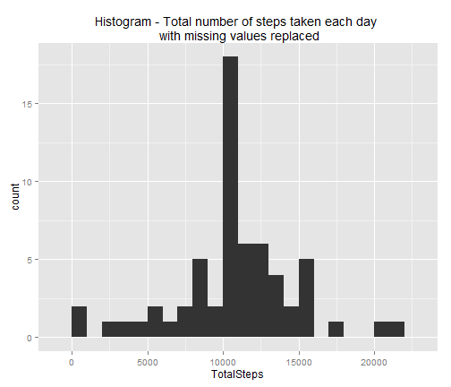
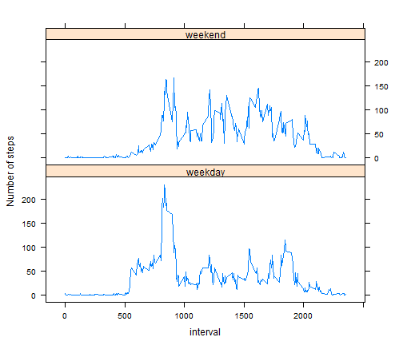

# Reproducible Research: Peer Assessment 1

# 
## Loading and preprocessing the data
# 


```r
data = read.csv("activity.csv")
data_by_date <- aggregate(data$steps, by = list(data$date), FUN = mean)
colnames(data_by_date) <- c("Date", "Mean_Steps")
steps_by_date <- aggregate(data$steps, by = list(data$date), FUN = sum)
colnames(steps_by_date) <- c("Date", "TotalSteps")
```


# 
## What is mean total number of steps taken per day?
# 


```r
library(ggplot2)
ggplot(steps_by_date, aes(x = TotalSteps)) + geom_histogram(binwidth = 1000) + 
    ggtitle("Histogram - Total number of steps taken each day")
```

 

```r
summary(steps_by_date)
```

```
##          Date      TotalSteps   
##  2012-10-01: 1   Min.   :   41  
##  2012-10-02: 1   1st Qu.: 8841  
##  2012-10-03: 1   Median :10765  
##  2012-10-04: 1   Mean   :10766  
##  2012-10-05: 1   3rd Qu.:13294  
##  2012-10-06: 1   Max.   :21194  
##  (Other)   :55   NA's   :8
```

```r
meanTotalSteps = mean(steps_by_date$TotalSteps, na.rm = TRUE)
medianTotalSteps = median(steps_by_date$TotalSteps, na.rm = TRUE)
```

### ------------------
### MEAN   - Number of total steps per day  = 1.0766 &times; 10<sup>4</sup>
### MEDIAN - Number of total steps per day  = 10765
### ------------------
# 
## What is the average daily activity pattern?
# 


```r
data_by_interval <- aggregate(data$steps, by = list(data$interval), FUN = mean, 
    na.rm = TRUE)
colnames(data_by_interval) <- c("Interval", "Mean_Steps")
plot(data_by_interval$Interval, data_by_interval$Mean_Steps, type = "l", xlab = "Interval", 
    ylab = "Mean Steps", main = "Daily Activity Pattern")
```

 

```r
mm = max(data_by_interval$Mean_Steps)
sm = subset(data_by_interval, data_by_interval$Mean_Steps == max(data_by_interval$Mean_Steps))
```

### ------------------
### The 835th 5-minute interval has maximum average steps 206.1698 
### ------------------
# 
## Imputing missing values
### Problem3 - step1 - Total number of rows with NAs
# 


```r
na_data <- subset(data, is.na(data$steps))
NumOfMissingValues = length(na_data$steps)
```

### ------------------
### The total number rows with missing values = 2304
### ------------------
# 
### Problem3 - step2 - Devise a strategy for filling in all of the missing values in the dataset. The strategy does not need to be sophisticated. For example, you could use the mean/median for that day, or the mean for that 5-minute interval, etc
# 
### ------------------
### The strategy is to fill the missing values with mean of that 5 minute interval,
### ------------------
# 
### Problem3 - step3 - Create a new dataset that is equal to the original dataset but with the missing data filled in
# 


```r
for (k in data_by_interval$Interval) {
    subdata = subset(data, data$interval == k)
    subdata$steps[is.na(subdata$steps)] <- data_by_interval$Mean_Steps[data_by_interval$Interval == 
        k]
    data$steps[data$interval == k] <- subdata$steps
}
```

# 
### Problem3 - step4 - Make a histogram of the total number of steps each day and calculate and report the mean and median total number of steps taken per day
# 


```r

steps_by_date <- aggregate(data$steps, by = list(data$date), FUN = sum)
colnames(steps_by_date) <- c("Date", "TotalSteps")

library(ggplot2)
ggplot(steps_by_date, aes(x = TotalSteps)) + geom_histogram(binwidth = 1000) + 
    ggtitle("Histogram - Total number of steps taken each day \n with missing values replaced")
```

 

```r
summary(steps_by_date)
```

```
##          Date      TotalSteps   
##  2012-10-01: 1   Min.   :   41  
##  2012-10-02: 1   1st Qu.: 9819  
##  2012-10-03: 1   Median :10766  
##  2012-10-04: 1   Mean   :10766  
##  2012-10-05: 1   3rd Qu.:12811  
##  2012-10-06: 1   Max.   :21194  
##  (Other)   :55
```

```r
mean_TSteps = mean(steps_by_date$TotalSteps)  # mean number of steps per day
median_TSteps = median(steps_by_date$TotalSteps)  # median number of steps per day
```

### ------------------
### MEAN   - Number of total steps per day  = 1.0766 &times; 10<sup>4</sup>
### MEDIAN - Number of total steps per day  = 1.0766 &times; 10<sup>4</sup>
### The mean stayed the same as before and median just has gone up by 1
### ------------------
# 
## Are there differences in activity patterns between weekdays and weekends? 
# 


```r

wk = transform(data, weekend = as.POSIXlt(date, origin = "%Y-%m-%d")$wday %in% 
    c(0, 6))
wk1 = transform(wk, day = "WeekDay")
wk1$day = ifelse(wk1$weekend == "TRUE", "WeekEnd", "WeekDay")


wk10 = subset(wk1, wk1$day == "WeekDay")
wk11 = subset(wk1, wk1$day == "WeekEnd")
wkday_by_interval <- aggregate(wk10$steps, by = list(wk10$interval), FUN = mean, 
    na.rm = TRUE)
colnames(wkday_by_interval) <- c("interval", "MeanSteps")
wkend_by_interval <- aggregate(wk11$steps, by = list(wk11$interval), FUN = mean, 
    na.rm = TRUE)
colnames(wkend_by_interval) <- c("interval", "MeanSteps")

wkend1 = cbind(wkend_by_interval, day = "weekend")
wkday1 = cbind(wkday_by_interval, day = "weekday")
wkdayend1 = rbind(wkday1, wkend1)
library(lattice)
xyplot(MeanSteps ~ interval | day, data = wkdayend1, ylab = "Number of steps", 
    panel = "panel.lines", layout = c(1, 2), scales = list(y = list(relation = "same")))
```

 


